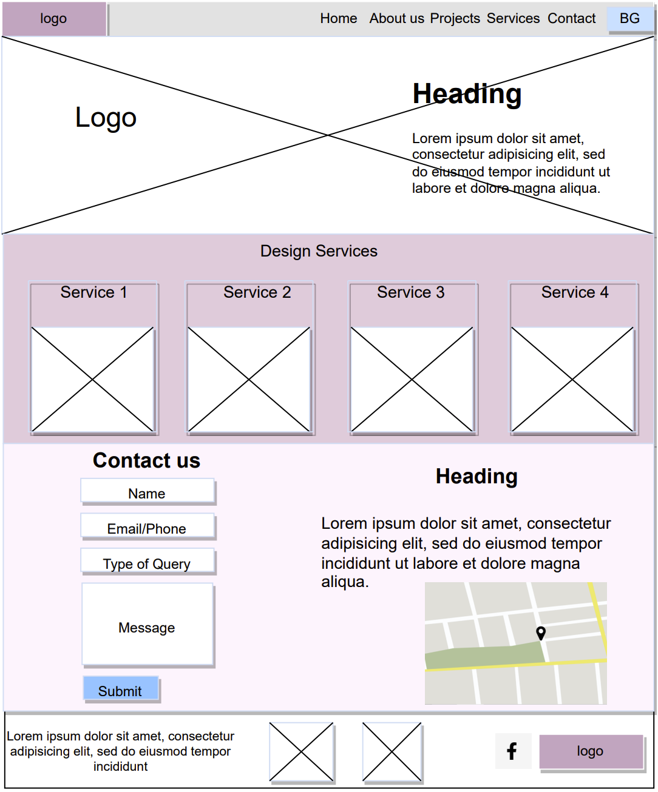

# DanArch Site
This website is created for a private architecture firm to enhance their online presence.

## Site Design
This wireframe represents the intended design of the website:

The homepage of this website has a header, a footer and 3 main sections.

**Header:**

* on the left side, contains a logo of this firm
* on the right side, contains a navigation bar with links to other pages and sections of the site
* it also has a button to switch between English and Bulgarian languages, enabling the accessibility of a broader audience 

**Section 1:**

* contains a background image
* a logo on the left side
* a short description of the firm on the right side

**Section 2:**

Consists of 4 identical clickable components representing design services and their images

**Section 3:**

* on the left side, there is a contact form which takes in a site visitor's name, email or phone number, type of query and an optional message
* on the right side, there is a description of how to find the firm's office if visiting in person, and a map image showing the location

**Footer:**

Has 3 groups of components: 

* on the left side it has the company's registration number
* in the center it has logos of chartered membership status and official registration
* on the right side it has a link to company's Facebook page and a logo